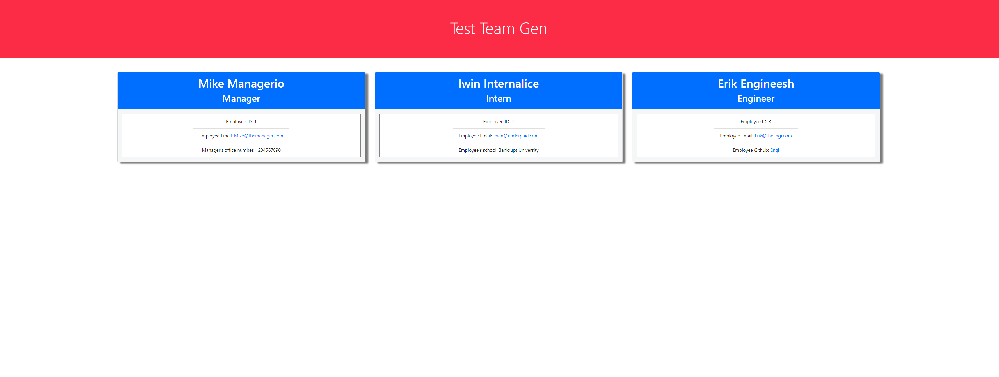

# Team-Profile-Generator

# Walkthrough Video
https://youtu.be/W7V6FAubMBY

# Contact
Vygoth
JeremyJoanet@Protonmail.com

## Description
This application will allow users to create a page with the name, job title, and contact information for a dev team.

## Table of Contents
- [Usage](#Usage)
- [Installation](#Dependancies)
- [Testing](#Testing)
- [Credits](#Credits)
- [Screenshot](#Screenshot)

## Usage
Open your terminal on the file, and type node index.js. Answer the question for team name, and select "yes" when prompted if you want to add a team member, you can add as many as you would like, the HTML file is created when you select "no" to the prompt.

## Dependancies
npm install

## Testing
npm run test

## Credits
Matt Reisdorf, Zach Duty.

## Contributing
N/A

## Screenshot

